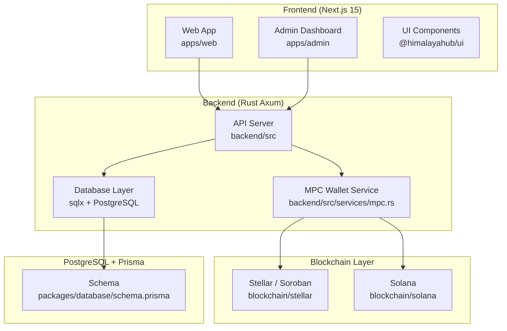
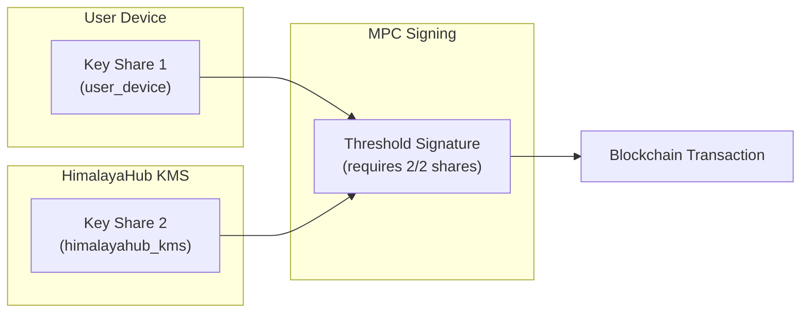
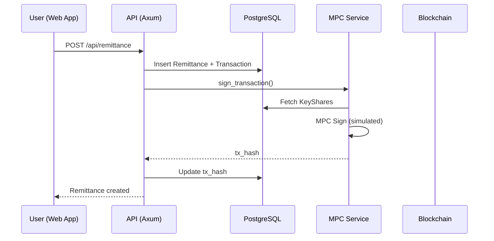
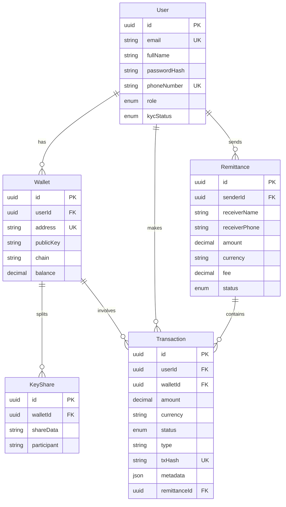
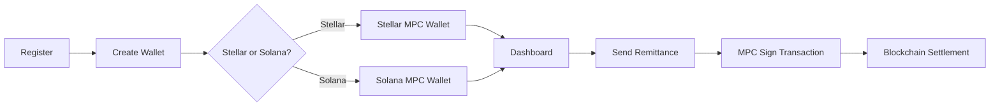
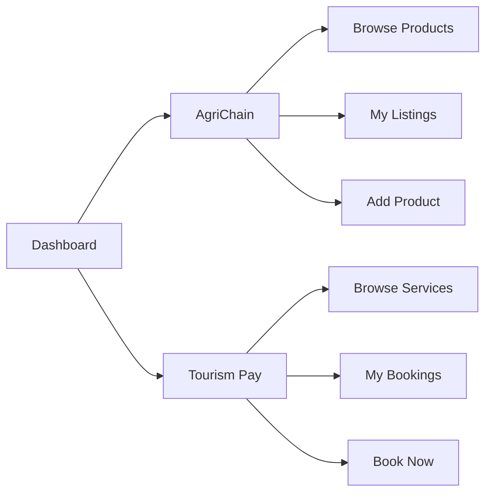

# HimalayaHub Architecture

## System Architecture



## Security Architecture (MPC Wallet)



## Data Flow: Remittance



## Database Schema Relationships



## Folder Structure

```
himalayahub/
├── apps/
│   ├── web/          # Main user-facing Next.js app
│   └── admin/        # Admin dashboard
├── backend/          # Rust Axum API server
├── blockchain/
│   ├── stellar/      # Soroban smart contracts
│   └── solana/       # Solana programs
├── packages/
│   ├── database/     # Prisma schema
│   ├── ui/           # Shared UI components
│   ├── types/        # Shared TypeScript types
│   └── config/       # Shared configuration
└── docs/             # Documentation
```

## User Flow: Phase 1 (Remittance + Wallet)



## User Flow: Phase 2 (AgriChain + Tourism)


